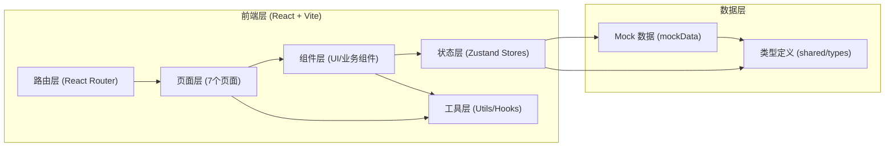
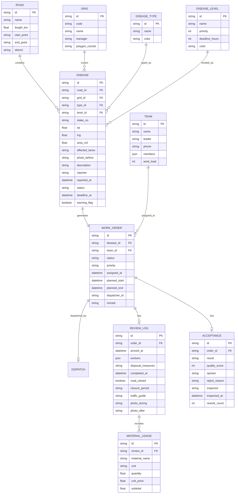

## 1. 架构设计



## 2. 技术描述

- **前端框架**：React@18 + TypeScript@5
- **构建工具**：Vite@5
- **路由管理**：react-router-dom@6
- **状态管理**：zustand@4
- **样式方案**：TailwindCSS@3 + CSS 变量
- **图表库**：recharts@2
- **图标库**：lucide-react
- **后端服务**：无后端，前端 Mock 数据模拟
- **初始化方式**：`react-ts` 模板（纯前端项目，含 tailwind/zustand/router）

## 3. 路由定义

| 路由路径 | 页面组件 | 说明 |
|---------|---------|------|
| `/` | `Dashboard` | 地图总览（默认首页） |
| `/ledger` | `Ledger` | 病害台账 |
| `/dispatch` | `Dispatch` | 工单调度 |
| `/review` | `Review` | 现场复核 |
| `/acceptance` | `Acceptance` | 维修验收 |
| `/reports` | `Reports` | 统计报表 |
| `/settings` | `Settings` | 系统设置 |

## 4. 数据模型

### 4.1 ER 图



### 4.2 核心类型定义（TypeScript）

```typescript
// shared/types/index.ts
export type DiseaseStatus = 'pending' | 'assigned' | 'processing' | 'reviewed' | 'accepted' | 'rejected';
export type DiseaseTypeCode = 'pothole' | 'crack' | 'subsidence' | 'rut' | 'bleeding' | 'other';
export type DiseaseLevelCode = 'mild' | 'moderate' | 'severe' | 'critical';
export type OrderStatus = 'unassigned' | 'assigned' | 'processing' | 'reviewed' | 'accepted' | 'rejected';
export type AcceptanceResult = 'passed' | 'rejected';
export type Role = 'admin' | 'dispatcher' | 'foreman' | 'inspector';

export interface Road {
  id: string;
  name: string;
  lengthKm: number;
  startPoint: string;
  endPoint: string;
  district: string;
}

export interface Grid {
  id: string;
  code: string;
  name: string;
  manager: string;
}

export interface DiseaseType {
  id: DiseaseTypeCode;
  name: string;
  color: string;
  icon: string;
}

export interface DiseaseLevel {
  id: DiseaseLevelCode;
  name: string;
  priority: number;
  deadlineHours: number;
  color: string;
}

export interface Disease {
  id: string;
  roadId: string;
  gridId: string;
  typeId: DiseaseTypeCode;
  levelId: DiseaseLevelCode;
  stakeNo: string;
  lat: number;
  lng: number;
  areaM2: number;
  affectedLanes: string[];
  photoBefore: string;
  description: string;
  reporter: string;
  reportedAt: string;
  status: DiseaseStatus;
  deadlineAt: string;
  warningFlag: 'none' | 'approaching' | 'overdue';
  mergedIds?: string[];
}

export interface Team {
  id: string;
  name: string;
  leader: string;
  phone: string;
  members: string[];
  workLoad: number;
}

export interface WorkOrder {
  id: string;
  diseaseId: string;
  teamId: string;
  status: OrderStatus;
  priority: DiseaseLevelCode;
  assignedAt: string | null;
  plannedStart: string | null;
  plannedEnd: string | null;
  dispatcher: string | null;
  remark: string | null;
}

export interface MaterialUsage {
  id: string;
  materialName: string;
  unit: string;
  quantity: number;
  unitPrice: number;
  subtotal: number;
}

export interface ReviewLog {
  id: string;
  orderId: string;
  arrivedAt: string;
  workers: string[];
  disposalMeasures: string;
  completedAt: string;
  roadClosed: boolean;
  closurePeriod: string;
  trafficGuide: string;
  photoDuring: string;
  photoAfter: string;
  materials: MaterialUsage[];
}

export interface AcceptanceRecord {
  id: string;
  orderId: string;
  result: AcceptanceResult;
  qualityScore: number;
  opinion: string;
  rejectReason: string | null;
  inspector: string;
  inspectedAt: string;
  reworkCount: number;
}

export interface MaterialDict {
  id: string;
  name: string;
  unit: string;
  defaultPrice: number;
}
```

## 5. 前端目录结构

```
src/
├── App.tsx                    # 根组件，包含路由出口与布局
├── main.tsx                   # 入口文件
├── index.css                  # 全局样式 + Tailwind 指令
├── assets/                    # 静态资源
│   └── images/                # 示例病害图片
├── components/                # 通用组件
│   ├── layout/                # 布局相关
│   │   ├── Sidebar.tsx        # 左侧导航
│   │   ├── Topbar.tsx         # 顶部状态栏
│   │   └── PageContainer.tsx  # 页面容器（面包屑+内容）
│   ├── ui/                    # 基础UI
│   │   ├── Button.tsx
│   │   ├── Input.tsx
│   │   ├── Select.tsx
│   │   ├── Table.tsx
│   │   ├── Modal.tsx
│   │   ├── Tabs.tsx
│   │   ├── Badge.tsx
│   │   ├── Card.tsx
│   │   ├── Tag.tsx
│   │   ├── Upload.tsx
│   │   ├── Progress.tsx
│   │   └── Steps.tsx
│   ├── charts/                # 图表组件
│   │   ├── BarChartCard.tsx
│   │   ├── PieChartCard.tsx
│   │   ├── LineChartCard.tsx
│   │   └── StatCard.tsx
│   ├── disease/               # 病害业务组件
│   │   ├── DiseaseForm.tsx
│   │   ├── DiseaseTable.tsx
│   │   ├── DiseaseMarker.tsx
│   │   ├── DiseaseDetail.tsx
│   │   ├── BatchActionBar.tsx
│   │   └── WarningBadge.tsx
│   ├── order/                 # 工单业务组件
│   │   ├── OrderCard.tsx
│   │   ├── AssignModal.tsx
│   │   ├── TeamLoadBoard.tsx
│   │   ├── ReviewForm.tsx
│   │   ├── MaterialTable.tsx
│   │   ├── AcceptanceForm.tsx
│   │   └── PhotoCompare.tsx
│   └── map/                   # 地图相关
│       ├── DiseaseMap.tsx
│       ├── MapFilterBar.tsx
│       └── MapLegend.tsx
├── pages/                     # 7个页面
│   ├── Dashboard.tsx
│   ├── Ledger.tsx
│   ├── Dispatch.tsx
│   ├── Review.tsx
│   ├── Acceptance.tsx
│   ├── Reports.tsx
│   └── Settings.tsx
├── hooks/                     # 自定义 Hooks
│   ├── useDiseaseStore.ts
│   ├── useOrderStore.ts
│   ├── useDictStore.ts
│   └── useFilter.ts
├── utils/                     # 工具函数
│   ├── mock.ts                # Mock 数据生成
│   ├── format.ts              # 格式化（日期、金钱、面积）
│   ├── export.ts              # Excel 导出工具
│   ├── warning.ts             # 预警计算
│   └── constants.ts           # 常量（状态映射等）
├── shared/
│   └── types/
│       └── index.ts           # 核心类型定义
└── store/                     # Zustand stores
    ├── diseaseStore.ts
    ├── orderStore.ts
    ├── reviewStore.ts
    ├── acceptanceStore.ts
    └── dictStore.ts
```

## 6. 状态管理设计

使用 Zustand 按业务领域拆分 Store：

- **diseaseStore**：病害列表、筛选条件、详情、批量操作状态
- **orderStore**：工单列表、派单、班组看板状态
- **reviewStore**：复核记录、材料用量、处置信息
- **acceptanceStore**：验收记录、整改跟踪
- **dictStore**：字典数据（道路、班组、病害类型/等级、材料等）

```typescript
// store/diseaseStore.ts 示例
export const useDiseaseStore = create<DiseaseState & DiseaseActions>((set, get) => ({
  diseases: [],
  filters: { keyword: '', type: null, level: null, status: null, roadId: null },
  selectedIds: [],
  // ... actions
}));
```

## 7. Mock 数据策略

- 在 `src/utils/mock.ts` 中生成 200+ 条病害记录，覆盖各类型、等级、状态
- 道路数据：20条市区主次干道
- 班组数据：8个养护班组
- 材料数据：10种常用养护材料
- 工单数据：按病害状态生成对应工单
- 图片资源：使用占位图服务 URL（如 picsum.photos）搭配病害类型关键词
