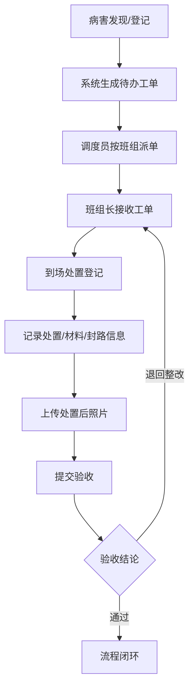

## 1. 产品概述

道路病害管理 Web 应用是面向市政养护中心的专业业务系统，用于登记、派单、跟踪和验收路面病害问题。系统实现从病害发现到维修验收的全流程闭环管理，提供数据统计分析辅助决策。

- 目标用户：市政养护中心管理人员、养护班组、现场复核人员、验收人员
- 核心价值：提升病害处置效率，规范养护作业流程，降低管理成本

## 2. 核心功能

### 2.1 用户角色

| 角色 | 说明 | 核心权限 |
|------|------|----------|
| 管理员 | 系统超级用户 | 全部功能、系统设置、用户管理 |
| 调度员 | 工单调度人员 | 病害登记、工单派发、台账管理、报表查看 |
| 班组长 | 养护班组负责人 | 查看工单、登记处置信息、现场复核 |
| 验收员 | 质量验收人员 | 维修验收、退回整改、验收记录查询 |

### 2.2 功能模块

1. **地图总览**：GIS地图展示病害点位分布，筛选查看，统计概览
2. **病害台账**：病害清单管理，新增/编辑/删除，合并重复，批量操作，预警，导出
3. **工单调度**：待办工单列表，按班组派单，工单状态跟踪
4. **现场复核**：复核登记，到场记录，处置详情，材料用量，封路情况
5. **维修验收**：前后照片对比，质量评估，验收通过/退回整改
6. **统计报表**：高发路段，处置时长，费用估算，未完成排行，趋势图
7. **设置**：基础数据配置（道路、班组、病害类型、等级），用户管理，参数设置

### 2.3 页面详情

| 页面名称 | 模块名称 | 功能描述 |
|---------|---------|----------|
| 地图总览 | 顶部统计卡 | 待处置/处理中/已验收/总数统计指标 |
| 地图总览 | 筛选工具栏 | 按病害类型、等级、时间范围、道路、网格筛选 |
| 地图总览 | GIS地图区域 | 点位标记（不同颜色区分类型/等级），点位弹窗详情，缩放平移，图层切换 |
| 地图总览 | 地图图例 | 病害类型、等级颜色对照说明 |
| 病害台账 | 搜索筛选区 | 关键词搜索，多条件组合筛选（类型、等级、状态、道路、桩号范围、时间） |
| 病害台账 | 病害列表 | 表格展示，支持排序、分页、行选中，状态标签颜色区分 |
| 病害台账 | 新增病害 | 弹窗表单：道路、桩号、网格、类型、等级、面积、影响车道、照片上传、描述 |
| 病害台账 | 批量操作 | 批量变更等级，批量指派，批量删除，合并重复点位 |
| 病害台账 | 预警标识 | 超期未处理红色预警，临近期限橙色提醒 |
| 病害台账 | 导出功能 | 导出当前筛选结果为 Excel |
| 工单调度 | 待办面板 | 未派单/已派单/处理中/已完成 Tab 分类 |
| 工单调度 | 工单卡片 | 病害摘要，优先级标签，到期时间，操作按钮 |
| 工单调度 | 派单弹窗 | 选择养护班组，指派人员，计划时间，备注 |
| 工单调度 | 班组看板 | 各班组当前工单负载可视化 |
| 现场复核 | 待复核列表 | 已派单等待现场处置的工单 |
| 现场复核 | 处置登记表单 | 到场时间、处置人员、处置措施、完成时间 |
| 现场复核 | 材料用量 | 材料类型、数量、单价、小计、合计 |
| 现场复核 | 封路信息 | 是否封路、封路时段、交通疏导方式 |
| 现场复核 | 现场照片 | 处置中、处置后照片上传 |
| 维修验收 | 待验收列表 | 已完成处置待验收的工单 |
| 维修验收 | 前后对比 | 病害发现时照片 vs 维修后照片左右对比滑块 |
| 维修验收 | 验收表单 | 验收结论（通过/退回），质量评分，验收意见，退回原因 |
| 维修验收 | 整改记录 | 退回历史，整改跟踪 |
| 统计报表 | 高发路段TOP10 | 柱状图展示病害数量最多的道路 |
| 统计报表 | 病害类型分布 | 饼图展示各类型占比 |
| 统计报表 | 处置时长趋势 | 折线图展示平均处置时长变化 |
| 统计报表 | 费用估算统计 | 按时间/班组/道路维度统计材料+人工费用 |
| 统计报表 | 未完成排行 | 各班组未完成工单数量排行 |
| 统计报表 | 等级分布 | 各等级病害数量堆叠柱状图 |
| 设置 | 道路管理 | 道路基础信息（名称、长度、起点终点、所属区域）增删改 |
| 设置 | 班组管理 | 养护班组（名称、负责人、联系电话、人员名单） |
| 设置 | 病害字典 | 病害类型、等级定义，处置时限配置 |
| 设置 | 材料字典 | 材料名称、单位、参考单价 |
| 设置 | 网格管理 | 管理网格划分，网格负责人 |

## 3. 核心流程

病害从发现到验收完成的主流程：调度员在病害台账登记病害点位（或地图上直接标绘）→ 系统自动生成待办工单 → 调度员在工单调度页面按养护班组派单 → 班组长接收工单后前往现场，在现场复核页面登记到场、处置详情、材料用量和封路情况，上传处置后照片 → 处置完成后流转至验收 → 验收员对比前后照片，作出验收通过或退回整改决定 → 验收通过则流程闭环，退回则返回班组长重新处置。

## 4. 用户界面设计

### 4.1 设计风格

- **主色调**：工业蓝 `#1E40AF`（专业、信赖感），辅以警示橙 `#F97316` 和危险红 `#DC2626`
- **次色调**：成功绿 `#16A34A`、信息青 `#0891B2`
- **中性色**：锌灰系列 `zinc-50` ~ `zinc-900`，背景 `#F8FAFC`
- **按钮风格**：方中带圆（圆角 6px），主按钮实色填充，次按钮描边，悬停 0.2s 过渡+轻微阴影
- **字体**：系统中文黑体栈 `PingFang SC, Microsoft YaHei, "Hiragino Sans GB", sans-serif`；数据展示等宽 `JetBrains Mono, Consolas, monospace`
- **布局风格**：左侧垂直导航（240px 固定宽度，深色背景）+ 顶部面包屑/状态栏 + 主内容区卡片式布局
- **图标风格**：Lucide 线性图标，16px/20px 为主，颜色随语义

### 4.2 页面设计概述

| 页面名称 | 模块名称 | UI 关键元素 |
|---------|---------|------------|
| 地图总览 | 统计卡 | 渐变图标背景 + 大号数字 + 环比百分比微标签 |
| 地图总览 | 筛选条 | 胶囊状标签选择器，下拉筛选器组合 |
| 地图总览 | 地图 | 蓝色渐变底图，彩色脉冲动画标记点，点击浮出信息卡片 |
| 病害台账 | 表格 | 斑马行、悬停高亮、状态徽章、预警圆点动画 |
| 病害台账 | 表单弹窗 | 分区布局（基础信息/位置信息/附件），带步骤指示器 |
| 工单调度 | 卡片 | 左侧彩色优先级竖条 + 标题 + 元信息行 + 操作按钮组 |
| 现场复核 | 表单 | 分区步骤条，时间线式登记，材料可增删行 |
| 维修验收 | 对比 | 左右分栏带可拖动分隔线，缩略图列表 |
| 统计报表 | 图表 | Recharts 图表，带网格背景，渐变色柱/线 |
| 设置 | 配置 | Tab 分栏，左列表右详情，即时保存提示 |

### 4.3 响应式

- **桌面优先**：默认以 1440px 宽度设计，自适应至 1280px、1920px
- **平板兼容**：左侧导航折叠为图标模式（64px），主内容区保留双栏
- **触控优化**：表格行高、按钮最小点击区域 40px，关键操作提供确认弹窗

### 4.4 动效与微交互

- 页面加载：导航区先入 → 顶部状态栏 → 主内容卡片依次淡入（stagger 60ms）
- 点位标记：新增点位有呼吸脉冲动画（`animate-ping` 变体）持续 3s
- 表格行/卡片：悬停 `translateY(-1px)` + 阴影加深
- 状态变更：颜色过渡 0.3s，伴随小型对勾/叹号图标弹入
- 验收对比滑块：左右 50% 默认位置，拖动时分界线显示阴影高光
